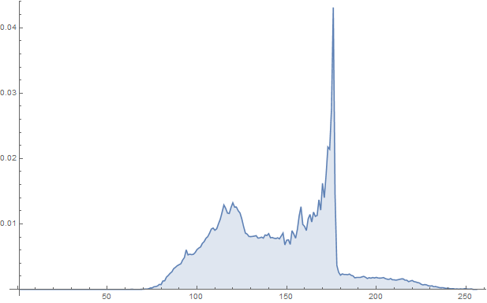
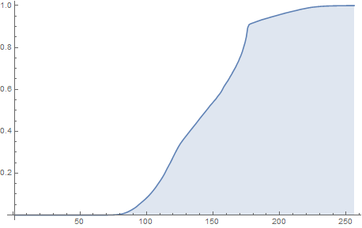
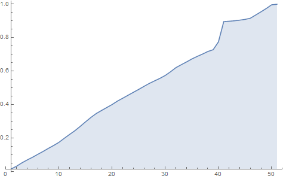
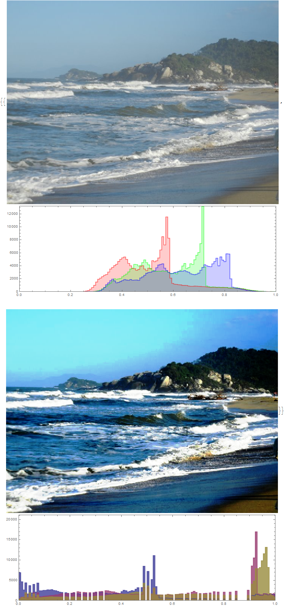

## Objective

The purpose of this lab is to implement an efficient histogramming equalization
	algorithm for an input image.
Like the image convolution MP, the image is represented as `RGB float` values.
You will convert that to `GrayScale unsigned char` values and compute the histogram.
Based on the histogram, you will compute a histogram equalization function which you will
	then apply to the original image to get the color corrected image.	

## Prerequisites

Before starting this lab, make sure that:

* You have completed all week 5 lecture videos

## Instruction

Edit the code in the code tab to perform the following:

* Cast the image to `unsigned char`

* Convert the image from RGB to Gray Scale

* Compute the histogram of the image

* Compute the scan and prefix sum of the histogram to arrive at the histogram equalization function

* Apply the equalization function to the input image to get the color corrected image

## Background

In this section we discuss some of the background details of the histogram equalization algorithm.
For images that represent the full color space, we expect an image's histogram to be evenly distributed.
This means that we expect the bin values in the histogram to be `256/pixel_count`.
This algorithm adjust an image's histogram so that all bins have equal probability.

We first need to convert the image to gray scale by computing it's luminosity values.
These represent the brightness of the image and would allow us to simplify the histogram computation.

The histogram computes the number of pixels having a specific brightness value.
Dividing by the number of pixels (width * height) gives us the probability of a luminosity value to occur in an image.

A color balanced image is expected to have a uniform distribution of the luminosity values.

This means that if we compute the Cumulative Distribution Function (CDF) we expect a linear curve for a color equalized image.
For images that are not color equalized, we expect the curve to be non-linear.

The algorithm equalizes the curve by computing a transformation function to map the original CDF to the desired CDF (the desired CDF being an almost linear function).

The computed transformation is applied to the original image to produce the equalized image.

Note that the CDF of the histogram of the new image has been transformed into an almost
	linear curve.

## Implementation Steps

Here we show the steps to be performed.
The computation to be performed by each kernel is illustrated with serial pseudo code.

### Cast the image from `float` to `unsigned char`

Implement a kernel that casts the image from `float *` to `unsigned char *`. 

	for ii from 0 to (width * height * channels) do
		ucharImage[ii] = (unsigned char) (255 * inputImage[ii])
	end

### Convert the image from RGB to GrayScale

Implement a kernel that converts the the RGB image to GrayScale

	for ii from 0 to height do
		for jj from 0 to width do
			idx = ii * width + jj
			# here channels is 3
			r = ucharImage[3*idx]
			g = ucharImage[3*idx + 1]
			b = ucharImage[3*idx + 2]
			grayImage[idx] = (unsigned char) (0.21*r + 0.71*g + 0.07*b)
		end
	end

### Compute the histogram of `grayImage`

Implement a kernel that computes the histogram (like in the lectures) of the image.

	histogram = [0, ...., 0] # here len(histogram) = 256
	for ii from 0 to width * height do
		histogram[grayImage[idx]]++
	end

### Compute the Cumulative Distribution Function of `histogram`

This is a scan operation like you have done in the previous lab

	cdf[0] = p(histogram[0])
	for ii from 1 to 256 do
		cdf[ii] = cdf[ii - 1] + p(histogram[ii])
	end

Where `p` is the probability of a pixel to be in a histogram bin

	def p(x):
		return x / (width * height)
	end

### Compute the minimum value of the CDF

This is a reduction operation using the min function

	cdfmin = cdf[0]
	for ii from 1 to 256 do
		cdfmin = min(cdfmin, cdf[ii])
	end

### Define the histogram equalization function

The histogram equalization function (`correct`) remaps the cdf of the histogram of the image to a linear function and is defined as

	def correct_color(val) 
		return clamp(255*(cdf[val] - cdfmin)/(1 - cdfmin), 0, 255)
	end

Use the same clamp function you used in the Image Convolution MP.

	def clamp(x, start, end)
    	return min(max(x, start), end)
	end

### Apply the histogram equalization function

Once you have implemented all of the above, then you
	are ready to correct the input image

	for ii from 0 to (width * height * channels) do
		ucharImage[ii] = correct_color(ucharImage[ii])
	end

### Cast back to `float`

	for ii from 0 to (width * height * channels) do
		outputImage[ii] = (float) (ucharImage[ii]/255.0)
	end

And you're done

## Image Format

For people who are developing on their own system.
The images are stored in PPM (`P6`) format, this means that you can (if you want) create your own input images.
The easiest way to create image is via external tools. You can use tools such as `bmptoppm`.

