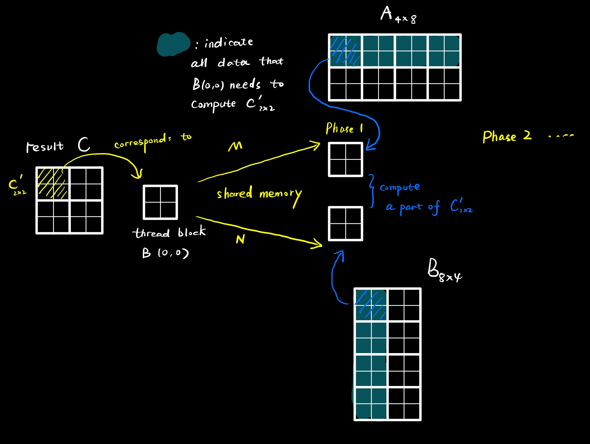

### Tiling Matrix Multiplication

#### Special case: width of matrix is multiple of tile width  

for each thread block: 

- allocate two $\text{BLOCK\_WIDTH}^2$ 2D-arrays to save a tile(aka. subset) of matrix $A,B$ respectively for each phase.

  NOTE: How  two shared memory arrays comes from?

  We divide the matrix into multiple small matrices whose size is equal to size of tile and want each thread can compute one element in result matrix $C$.

  

- for each phase:

  - Using current tile to update shared memory array.

    Because size of a tile is equal to size of a shared memory array, we can let each thread load value in relative postion of current tile.

  - Compute inner products in current tile.

#### Boundary check: matrix with arbitrarywidth

Suppose there is matrix multiplication $A_{m\times k}\times B_{k\times n} = C_{m\times n}$.

Consider a fixed thread block $B_{t\times t}$ resiponsible for computing $C'_{t\times t}$(sub-matrix of $C$ same as the figure above). We do boundary check only in two case:

- Load data from $A$ or $B$

  Coordinates cannot exceed the width(height) of $A$ or $B$ 

- Compute

  Only threads whose coordinates are within the range of the matrix need to calculate.

---

### Limiting factor to parallelism: Memory

In my MP3's code, I orgnaze the CUDA kernal as **32×32**  thread block. And for each thread block, I allocate 32×32×4B = 4KB of shared memory to save subset of matrix $M, N$ respectively, say 8KB in total for each thread block.

Recall MP1(see `MP1.md`), we know that maximum # of block per SM is **16** indicated by `deviceProp.maxBlocksPerMultiProcessor`. Therefore, we need 8KB×16=128KB shared memory to allows **16** blocks to simultaneously reside in an SM. But `deviceProp.sharedMemPerMultiprocessor` shows that GeForce RTX 3060 only has 100K-bytes of shared memory per SM. In other word, 32×32 Tiles can not make best use of parallelism ability of SM.